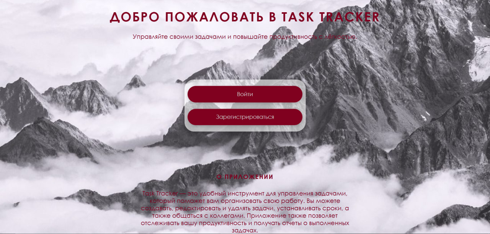
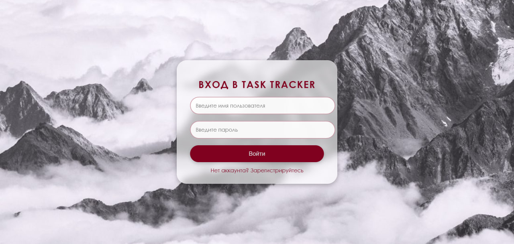
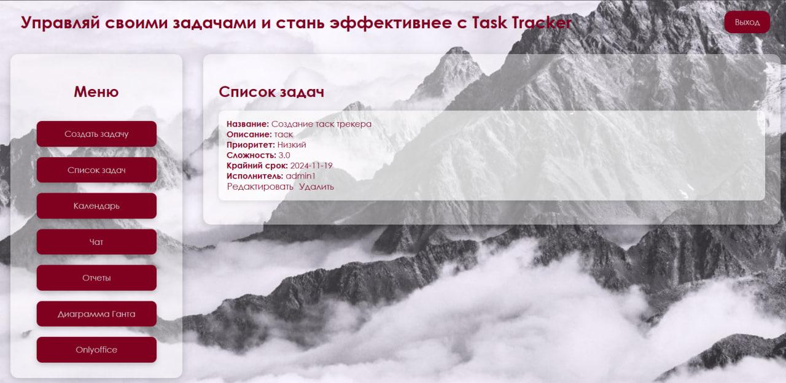
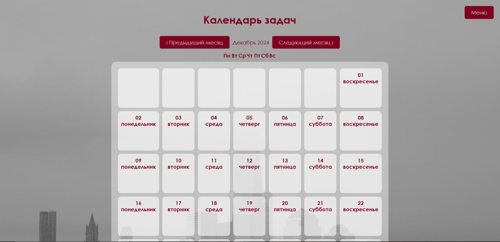
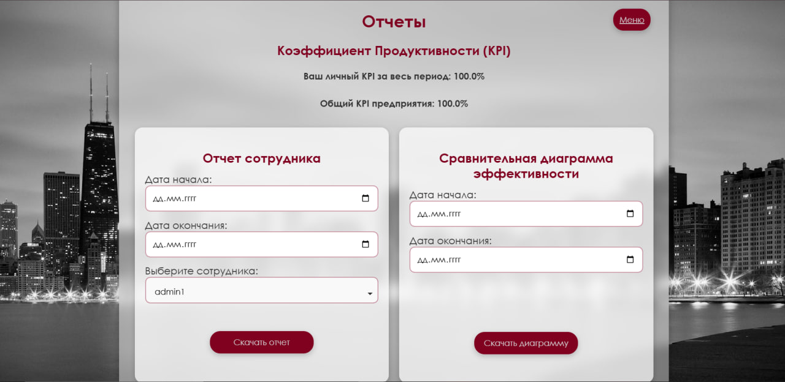

# Система отслеживания производительности сотрудников

Этот проект — веб-платформа для отслеживания и управления производительностью сотрудников, управления задачами и расчёта KPI. Он предоставляет единый инструмент для оценки производительности, включая интеграцию с **OnlyOffice** для редактирования документов, **Диаграмму Ганта** для планирования задач и функциональный дашборд для просмотра прогресса сотрудников и команд.

## Особенности

- **Расчёт KPI**: Эффективное отслеживание и расчёт индивидуальных и командных KPI.
- **Диаграмма Ганта**: Визуализация временных рамок проекта и зависимостей задач с помощью интерактивной диаграммы Ганта.
- **Редактирование документов с OnlyOffice**: Интеграция OnlyOffice для совместной работы над документами и их управления.
- **Управление задачами**: Создание, редактирование и управление задачами с чёткими сроками, приоритетами и назначениями.
- **Дашборд производительности**: Просмотр KPI, прогресса задач и отчётов на центральной панели.
- **Отчёты**: Генерация подробных отчётов на основе данных о производительности сотрудников.

## Технологии

- **Frontend**: HTML, CSS, JavaScript
- **Backend**: Python (Flask)
- **База данных**: PostgreSQL
- **Внешние библиотеки**:
  - **dhtmlx-gantt**: Для визуализации диаграммы Ганта.
  - **OnlyOffice**: Для управления и редактирования документов.
- **Система контроля версий**: Git
## Страницы проекта

### 1. **Индекс (Index)**

Страница индекса представляет собой главную страницу вашего приложения, которая предоставляет доступ ко всем основным разделам системы. Это своеобразная точка входа, на которой отображаются ссылки на другие страницы.



### 2. **Логин (Login)**

Страница логина позволяет пользователям войти в систему. Здесь пользователь вводит свои учетные данные (логин и пароль), чтобы получить доступ к личному кабинету и функционалу приложения. Если учетных данных нет, предусмотрена возможность регистрации.



### 3. **Дашборд (Dashboard)**

На странице дашборда отображаются ключевые показатели производительности (KPI) сотрудников, а также прогресс выполнения задач. Это центральное место для мониторинга результатов, где представлены графики, таблицы и другие инструменты для анализа.



### 4. **Календарь (Calendar)**

Страница календаря предоставляет возможность просматривать задачи, события и дедлайны в календарном формате. Пользователи могут легко отслеживать задачи и сроки их выполнения, а также планировать свои рабочие дни.



### 5. **Отчёты (Reports)**

Страница отчётов позволяет генерировать различные отчёты на основе производительности сотрудников и выполнения задач. Отчёты могут быть настроены по различным параметрам, таким как период времени, типы задач и их статус. Это помогает в анализе и принятии решений по улучшению процессов.



## Установка

Чтобы запустить проект, выполните следующие шаги:

### 1. Клонируйте репозиторий

```bash
git clone https://github.com/aleksandrvolostnov/KPI.git
cd KPI


