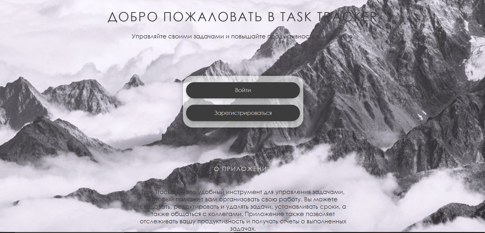
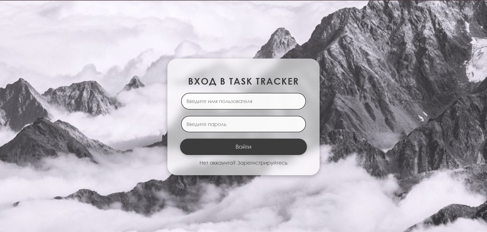
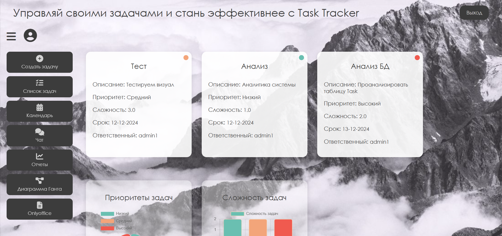
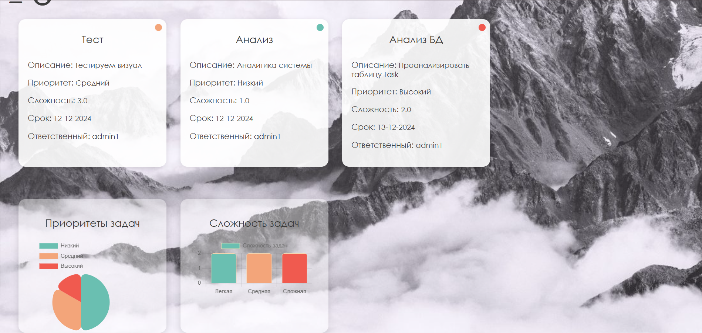
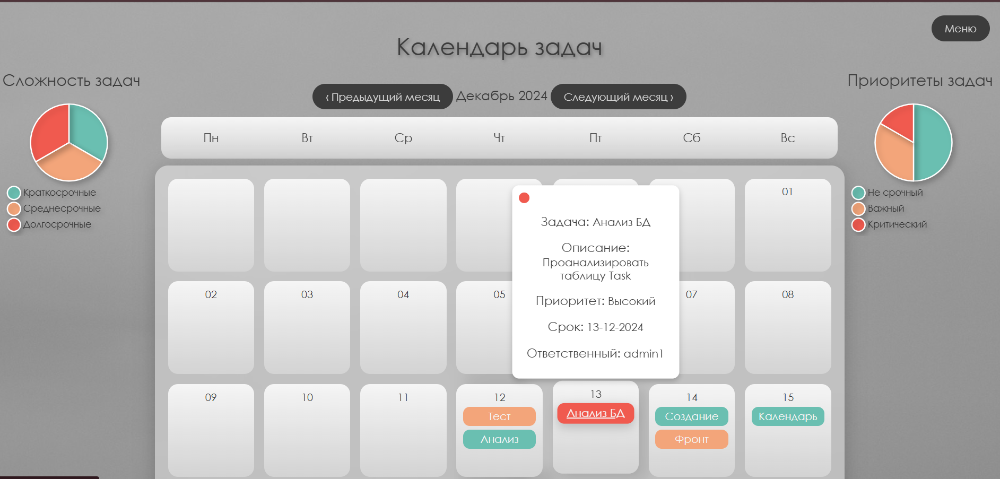
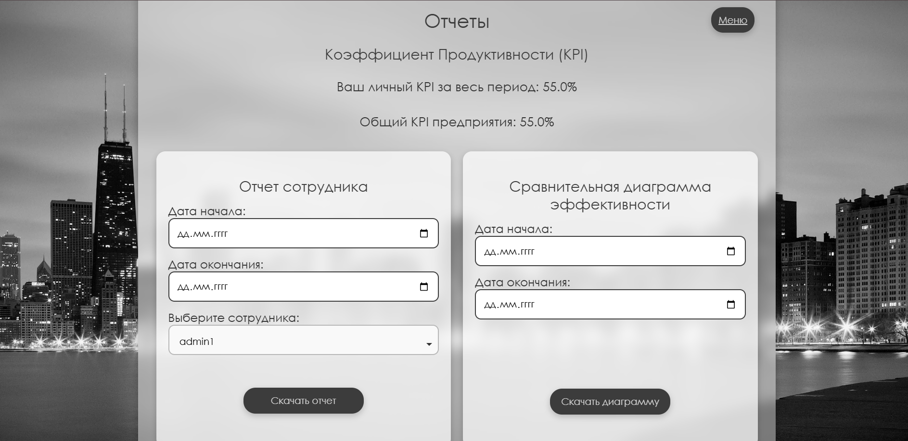
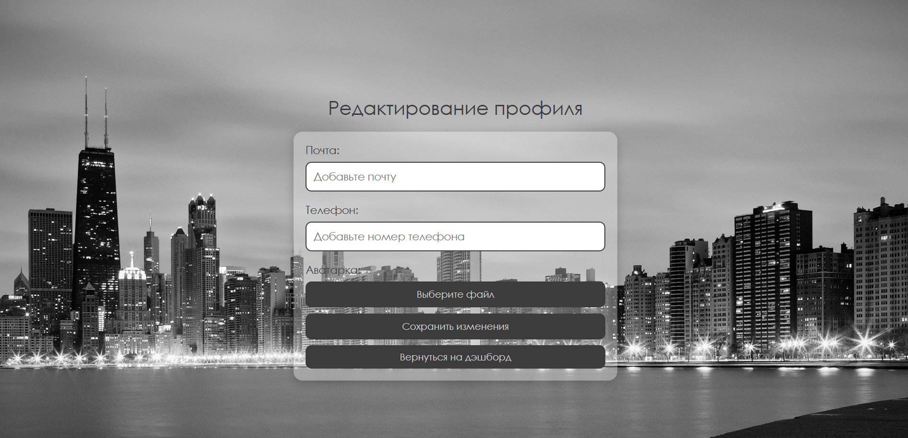
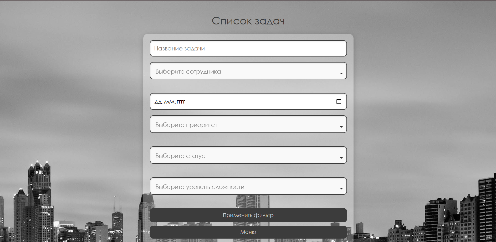
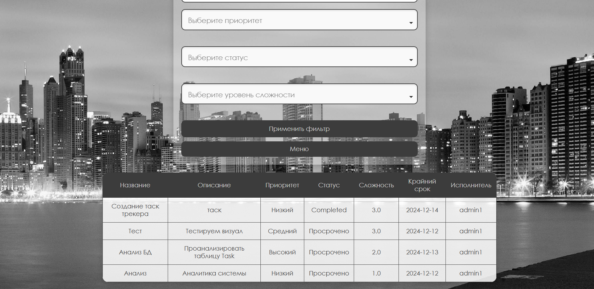
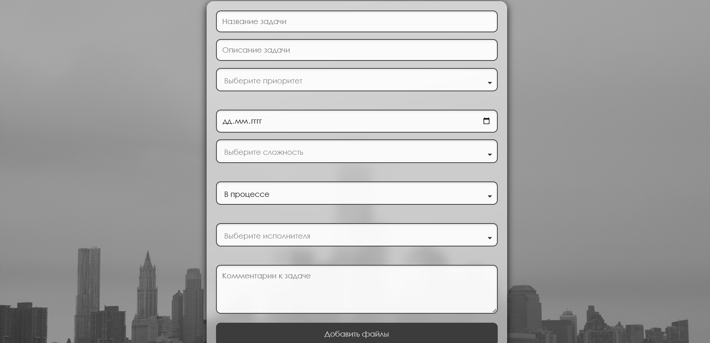

# Система отслеживания производительности сотрудников

Этот проект — веб-платформа для отслеживания и управления производительностью сотрудников, управления задачами и расчёта KPI. Он предоставляет единый инструмент для оценки производительности, включая интеграцию с **OnlyOffice** для редактирования документов, **Диаграмму Ганта** для планирования задач и функциональный дашборд для просмотра прогресса сотрудников и команд.

## Особенности

- **Расчёт KPI**: Эффективное отслеживание и расчёт индивидуальных и командных KPI.
- **Диаграмма Ганта**: Визуализация временных рамок проекта и зависимостей задач с помощью интерактивной диаграммы Ганта.
- **Редактирование документов с OnlyOffice**: Интеграция OnlyOffice для совместной работы над документами и их управления.
- **Управление задачами**: Создание, редактирование и управление задачами с чёткими сроками, приоритетами и назначениями.
- **Дашборд производительности**: Просмотр KPI, прогресса задач и отчётов на центральной панели.
- **Отчёты**: Генерация подробных отчётов на основе данных о производительности сотрудников.

## Технологии

- **Frontend**: HTML, CSS, JavaScript
- **Backend**: Python (Flask)
- **База данных**: PostgreSQL
- **Внешние библиотеки**:
  - **dhtmlx-gantt**: Для визуализации диаграммы Ганта.
  - **OnlyOffice**: Для управления и редактирования документов.
- **Система контроля версий**: Git
# Описание страниц проекта

## 🌟 Welcome Page (`welcome.html`)
Добро пожаловать в вашу личную систему управления задачами и производительностью! Эта страница — ворота в мир эффективности и контроля.  

**Особенности:**  
- 📝 *Краткий обзор возможностей системы*: От отслеживания задач до детализированных отчётов по KPI.  
- 🎨 *Современный и привлекательный дизайн* с мягкими тенями и плавными анимациями.  
- 🚀 *Простые кнопки навигации* для моментального входа или регистрации.

**Почему это круто?**  
Эта страница создаёт первое впечатление о системе и мотивирует пользователя погрузиться в работу.

---

## 🔐 Login Page (`login.html`)
Безопасный и удобный вход в систему — ваша точка доступа к миру продуктивности.  

**Особенности:**  
- 🔒 *Надёжная аутентификация*: Вход по логину и паролю.  
- ✨ *Интерактивные поля ввода* с плавными анимациями и эффектами наведения.  
- 🔄 *Ссылка для восстановления пароля*, чтобы вы никогда не теряли доступ к своим данным.

**Почему это важно?**  
Безопасность и простота входа гарантируют, что ваши данные всегда под контролем.

---

## 📝 Register Page (`register.html`)
Быстрая регистрация для новых пользователей — начните путь к продуктивности за считанные минуты!  

**Особенности:**  
- 🧩 *Интуитивно понятная форма*: Минимум полей для ввода, максимум комфорта.  
- 🎉 *Эффекты наведения и анимации* для приятного взаимодействия.  
- ✅ *Подтверждение регистрации* для безопасности и уверенности.

**Почему это привлекательно?**  
Новая учётная запись — новый шаг к упорядоченной и эффективной работе.

---

## 📊 Dashboard Page (`dashboard.html`)
Центр управления вашей продуктивностью! Здесь собраны все важные показатели и задачи в одном месте.  

**Особенности:**  
- 📈 *Визуализация KPI*: Диаграммы и графики для наглядного анализа производительности.  
- ✅ *Список текущих задач*: Контроль и выполнение без лишних движений.  
- 🌐 *Гибкая навигация* по всем ключевым разделам системы.

**Почему это полезно?**  
Мгновенный доступ к актуальной информации помогает принимать обоснованные решения.

---

## 📅 Calendar Page (`calendar.html`)
Управляйте временем с умом! Ваши задачи и дедлайны организованы в удобном календаре.  

**Особенности:**  
- 🗓️ *Интерактивный календарь*: Добавляйте, редактируйте и удаляйте задачи легко.  
- 🔔 *Напоминания и уведомления*, чтобы ничего не упустить.  
- 🎨 *Цветовая маркировка задач* для наглядности и удобства.

**Почему это эффективно?**  
Организованный календарь — ключ к соблюдению сроков и увеличению продуктивности.

---

## 📈 Reports Page (`reports.html`)
Подробные отчёты о вашей производительности и KPI. Анализируйте. Улучшайте. Достигайте!  

**Особенности:**  
- 📊 *Сравнительные графики и диаграммы* для глубокого анализа.  
- 📑 *Экспорт данных в Excel* для дальнейшей работы.  
- 🔍 *Фильтры и сортировка*, чтобы найти нужные данные быстро.

**Почему это ценно?**  
Визуализация результатов помогает увидеть слабые места и точки роста.

---

## 🧑‍💼 Profile Page (`profile.html`)
Ваше персональное пространство для настройки профиля и управления аккаунтом.  

**Особенности:**  
- 🖼️ *Загрузка и настройка аватара*.  
- 📝 *Редактирование личной информации*.  
- ✨ *Современный дизайн* с плавными эффектами и прозрачным фоном.

**Почему это удобно?**  
Настройте профиль под себя и сделайте работу комфортнее.

---

## ✅ Tasks Page (`tasks.html`)
Полный список всех ваших задач с возможностью фильтрации и управления.  

**Особенности:**  
- 📋 *Удобный список задач* с цветовой маркировкой статусов.  
- 🛠️ *Интерактивные кнопки* для выполнения, редактирования и удаления задач.  
- 🔍 *Фильтры по статусам и приоритетам*.

**Почему это помогает?**  
Централизованное управление задачами упрощает рабочий процесс.

---

## ➕ Create Task Page (`create_task.html`)
Добавляйте новые задачи быстро и просто!  

**Особенности:**  
- 📝 *Удобная форма* с полями для названия, описания, дедлайна и приоритета.  
- 🕒 *Выбор даты и времени* выполнения задачи.  
- 🎨 *Интерактивный интерфейс* с эффектами наведения и тенями.

**Почему это полезно?**  
Добавление задач никогда не было таким простым и приятным!

---

